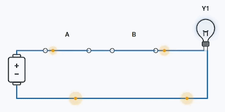
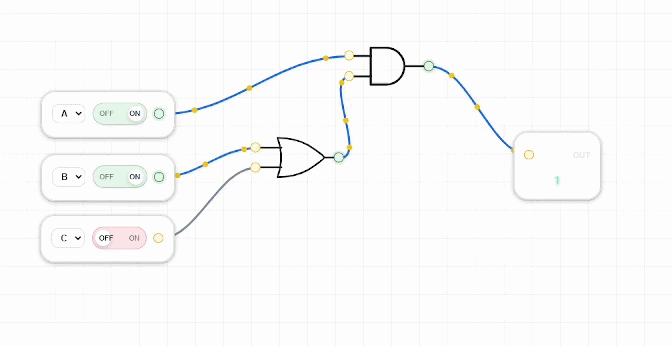

# LogicSim

	

	<a href="#introducao">Introdução</a> &middot; <a href="#recursos">Recursos</a> &middot; <a href="#tecnologias">Tecnologias</a> &middot;
 <a href="#exemplos-em-gif">Exemplos</a> &middot; <a href="#objetivo-academico">Objetivo</a>

## Introdução

LogicSim é um simulador web de circuitos lógicos digitais feito para estudo, experimentação e apoio acadêmico. A aplicação permite montar circuitos com portas lógicas, conectar componentes, alternar entradas, visualizar expressões booleanas, gerar tabela verdade e acompanhar uma representação de circuito de comutação.

## Recursos

- Editor visual para montar circuitos logicos.
- Componentes: Input, Output, AND, OR, NOT, NAND, NOR, XOR e XNOR.
- Conexoes por fios entre pinos de entrada e saida.
- Inputs com switch ON/OFF para alternar entre 0 e 1.
- Calculo em tempo real da saida do circuito.
- Exibicao da expressao booleana.
- Copia da expressao booleana pelo toolbar.
- Zoom no editor.
- Modo de exclusao para remover portas e fios.
- Geracao de tabela verdade.
- Visualizacao do circuito de comutacao equivalente.
- Tema claro e escuro.
- Paginas auxiliares: Sobre e Saiba Mais.

## Tecnologias

- HTML5
- CSS3
- JavaScript modular
- SVG para portas, fios e elementos visuais
- Font Awesome para icones

## Exemplos em GIF

Abaixo seguem dois exemplos animados mostrando como usar o simulador.

- Exemplo: montagem e acionamento de um circuito simples

	

- Exemplo: fluxo de sinais no editor do simulador

	

## Objetivo academico

O LogicSim foi desenvolvido como projeto universitario para facilitar o aprendizado de logica digital, portas logicas, expressoes booleanas e circuitos combinacionais.